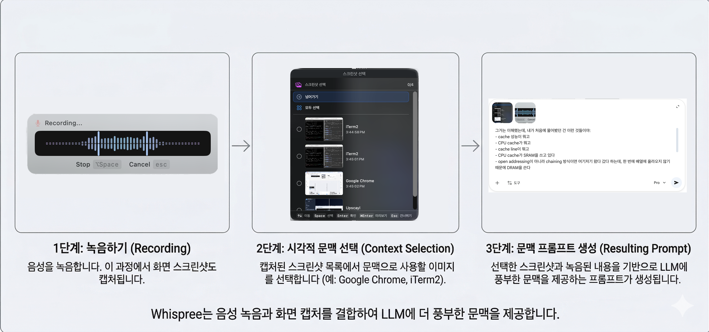

# Whispree

> OpenAI 계정 하나로 입코딩 시작하기.

[English](README.md) | 한국어


<p align="center">
  
</p>

## 주요 기능

### Voice-to-Prompt

Whispree는 **AI에게 말로 시키는 앱**입니다. Cursor, Claude, ChatGPT — 어디서든 프롬프트 입력창에 커서를 놓고 핫키를 누르면 됩니다. 말하고 나면 교정된 텍스트가 원래 커서 위치에 자동 붙여넣기됩니다.

타이핑 대비 3~5배 빠르고, 생각의 흐름이 끊기지 않습니다. 녹음 중에 다른 창을 봤어도 처음 포커스 위치를 기억하고 정확히 그곳에 삽입합니다.

### Visual Context

녹음을 시작하는 순간, 포커스된 화면의 스크린샷을 자동으로 찍어서 프롬프트와 함께 넘깁니다. 말한 내용만으로는 전달하기 어려운 시각적 맥락이 자동으로 붙으니, AI가 더 정확하게 이해합니다. 스크린샷을 따로 찍고 드래그해서 붙이는 과정이 사라집니다.

### 코드스위칭 최적화

영어 섞어서 말하는 한국인 개발자를 위해 만들었습니다. LLM 교정이 한국어 속 영어 기술 용어를 잡아줍니다.

```
"밸리데이션 해야 되거든"  →  "validation 해야 되거든"
"리엑트 컴포넌트"        →  "React 컴포넌트"
"깃허브에 PR 올려놨어"   →  "GitHub에 PR 올려놨어"
```

### 교정 모드

| 모드                      | 설명 |
|-------------------------|------|
| Standard                | STT 오류 교정 — 띄어쓰기, 맞춤법, 잘못 인식된 단어 |
| Filler Removal          | STT 교정 + 추임새 제거 (음, 어, 그러니까, 뭐랄까) |
| Structured (for Prompt) | STT 교정 + 추임새 제거 + 불릿포인트로 구조화. 두서없이 말해도 AI한테 명확한 지시가 됩니다 |
| Custom                  | 직접 작성한 시스템 프롬프트로 교정 |

### 스마트 받아쓰기

- **녹음** — `Ctrl+Shift+R` (기본값). Push to Talk(누르고 있으면 녹음) 또는 Toggle(한 번 누르면 시작, 다시 누르면 중지) 모드 지원
- **Quick Fix** — `Ctrl+Shift+D` (기본값). 잘못 인식된 단어를 교정 사전에 바로 등록 & Replace
- **취소** — `ESC`. 녹음 중 언제든 취소
- 모든 단축키는 설정에서 변경할 수 있습니다.

### 거의 무료

STT는 Groq을 쓰고, LLM은 Codex OAuth를 빌려씁니다.
Groq STT는 무료이고, OpenAI LLM 교정은 [Codex CLI](https://github.com/openai/codex) 인증 토큰을 그대로 가져다 씁니다.
OpenAI 계정만 있으면 사실상 추가 비용 없이 고품질 STT + LLM 교정을 쓸 수 있습니다.

## 설치

### Homebrew (권장)

```bash
brew tap Arsture/whispree && brew install --cask whispree
```

### GitHub Releases

> **참고:** 앱이 공증되지 않았습니다 (Apple Developer ID 없음). [GitHub Releases](https://github.com/Arsture/whispree/releases)의 `.zip`/`.dmg` 다운로드는 macOS Gatekeeper에 의해 차단됩니다. 압축 해제 후 터미널에서 `xattr -cr Whispree.app`을 실행해야 합니다. **Homebrew 설치를 강력히 권장합니다** — Gatekeeper 우회를 자동으로 처리합니다.

### 소스에서 빌드

```bash
git clone https://github.com/Arsture/whispree.git
cd whispree
brew install xcodegen
xcodegen generate
open Whispree.xcodeproj
# Xcode에서 Cmd+R로 빌드 및 실행
```

SPM 의존성은 첫 빌드 시 자동으로 해결됩니다.

## 사용법

### 기본 흐름

1. **첫 실행** — 마이크 권한과 접근성 권한을 허용합니다.
2. **모델 다운로드** — 설정 > 모델에서 사용할 STT/LLM 모델을 다운로드합니다. (클라우드 프로바이더만 쓸 경우 불필요)
3. **녹음** — AI 프롬프트 입력창에 커서를 놓고 `Ctrl+Shift+R`. 화면 스크린샷이 자동으로 캡처됩니다.
4. **삽입** — 교정된 텍스트가 처음 커서가 있던 위치에 자동 붙여넣기됩니다. 녹음 중 다른 창을 봤어도 정확히 원래 위치로 돌아갑니다.

### Quick Fix

자주 틀리는 단어가 있다면 `Ctrl+Shift+D`로 교정 사전에 등록하세요. 도메인 단어 세트(프로그래밍, 의료 등)를 만들어두면 해당 분야 용어 인식률이 올라갑니다.

### 설정

메뉴바 아이콘에서 설정에 접근할 수 있습니다.

- **일반** — 단축키 변경, 녹음 모드(Push to Talk / Toggle), 로그인 시 자동 시작
- **STT** — STT 프로바이더 선택 (WhisperKit, Groq, MLX Audio) + 호환성 등급 표시
- **LLM** — LLM 프로바이더 선택 (없음, 로컬 6종, OpenAI 5종) + 교정 모드 설정
- **다운로드** — 로컬 모델 다운로드/삭제 + Can I Run 호환성 (RAM%, tok/s, 등급)

### 외부 도구에서 트리거 (URL 스킴)

Whispree는 URL 스킴을 등록하기 때문에, 외부 자동화 도구에서 모디파이어 핫키 없이 바로 녹음을 시작/정지할 수 있습니다.

```bash
open "whispree://toggle"   # 녹음 시작/정지 토글
open "whispree://push"     # 녹음 시작
open "whispree://release"  # 녹음 정지 및 전사
```

**Raycast** (Create Quicklink → 단축키 할당), **Stream Deck** ("System: Open" 액션 — push/release를 버튼 두 개로 분리), **Keyboard Maestro**, **AppleScript** 모두에서 사용할 수 있습니다.

```applescript
tell application "Whispree" to open location "whispree://toggle"
```

## 팁

> **Structured Mode를 기본으로 쓰세요.** AI한테 말로 지시하는 경우가 많다면, LLM 설정에서 Structured 모드를 켜두세요. 두서없이 말해도 불릿포인트로 정리된 프롬프트가 들어갑니다. 머릿속에 아이디어가 명확할수록 효과가 큽니다 — 타이핑으로 정리하는 시간이 통째로 사라집니다.

> **기획할 때 말로 쏟아내세요.** 머릿속에 구상이 잡혀 있을 때, 그걸 타이핑으로 옮기는 건 병목입니다. 핫키 누르고 쭈루룩 말하면 Structured Mode가 구조를 잡아줍니다. 초기 기획일수록, 말로 빠르게 쏟아내는 게 텍스트로 정리하는 것보다 훨씬 효율적입니다.

> **공부할 때 이해의 경계를 말하세요.** "여기까지는 이해했는데, 이 부분부터 모르겠다"를 말로 쏟아내는 데 Whispree가 잘 맞습니다. 모르는 걸 텍스트로 정리하려면 오래 걸리지만, 말로는 생각나는 대로 빠르게 나옵니다.

> **스크린샷을 적극적으로 활용하세요.** 녹음 중에 화면을 보면 자동으로 스크린샷이 찍힙니다. 탭을 전환하면 이전 탭이 즉시 캡처되고, 한 화면에서 스크롤하다 1.5초 멈추면 그 시점이 캡처됩니다. 여러 탭을 돌아다녀도 본 화면이 전부 기록됩니다. 녹음이 끝나면 선택 패널에서 AI에 보낼 스크린샷을 골라 첨부할 수 있습니다. OpenAI 같은 Vision 지원 모델을 쓰면 LLM이 스크린샷을 참고해서 교정하기 때문에, 수식이나 전문 용어도 정확하게 잡아줍니다. 논문의 수식을 보면서 "이 부분이 이해가 안 된다"고 말하면, 스크린샷 + 음성이 함께 AI에 들어갑니다.

> **말이 정리가 안 될 때는 타이핑하세요.** 생각이 명확할 때는 말이 빠르고, 아직 뭘 말해야 할지 모를 때는 타이핑하며 정리하는 게 낫습니다. Whispree는 "이미 아는 걸 빠르게 전달하는 도구"에 가깝습니다.

> **직장인 팁**: 에어팟 끼고 통화하는 척하면 됩니다. 사물과 대화하는 사람으로 보이지 않아요.

## 프로바이더 선택

[OpenCode](https://github.com/nicepkg/opencode)가 되고 싶습니다. 아직은 갈길이 멀지만, STT와 LLM 프로바이더를 직접 골라 쓸 수 있습니다.

| | STT | LLM |
|---|---|---|
| **클라우드 (권장)** | [Groq](https://groq.com/) — 정확, 빠름 | [OpenAI via Codex CLI](https://github.com/openai/codex) — 기존 계정 그대로 |
| **로컬** | [WhisperKit](https://github.com/argmaxinc/WhisperKit) — CoreML+ANE, 적당히 정확 | [mlx-swift-lm](https://github.com/ml-explore/mlx-swift-lm) — 6개 모델 지원 |
| **로컬** | [MLX Audio](https://github.com/ml-explore/mlx-audio) — 빠름, 가벼움 | [MLXVLM](https://github.com/ml-explore/mlx-swift-lm) — 비전 모델 (스크린샷 컨텍스트) |

### 지원 모델

앱 내 **Can I Run** 기능이 하드웨어(칩, RAM, 대역폭)를 감지하여 각 모델의 호환성 등급을 자동으로 표시합니다.

#### STT (음성 인식)

| 프로바이더 | 모델 | 크기 | 타입 |
|----------|------|------|------|
| **Groq** | `whisper-large-v3-turbo` | ☁️ | 클라우드 |
| **WhisperKit** | `openai_whisper-large-v3_turbo` | ~1.5 GB | 로컬 (CoreML+ANE) |
| **MLX Audio** | `Qwen3-ASR-1.7B-8bit` | ~1.0 GB | 로컬 (Python worker) |

#### LLM (텍스트 교정)

| 프로바이더 | 모델 | 크기 | 비고 |
|----------|------|------|------|
| **OpenAI** | `gpt-5.4` (기본), `5.4-mini`, `5.3-codex`, `5.3-codex-spark`, `5.2-codex` | ☁️ | 최고 품질 |
| **로컬 Text** | `Qwen3-1.7B-4bit` | ~940 MB | 경량, 빠른 속도 |
| **로컬 Text** | `Qwen3-4B-Instruct-2507-4bit` (기본) | ~2.1 GB | 균형 잡힌 기본값 |
| **로컬 Text** | `Qwen3-8B-4bit` | ~4.3 GB | 고품질 한국어 |
| **로컬 Text** | `Qwen3-Coder-30B-A3B-Instruct-4bit` | ~16 GB | MoE 코딩 특화 (32GB+ 권장) |
| **로컬 Text** | `GLM-4.7-Flash-4bit` | ~16 GB | 중국어/한국어 (32GB+ 권장) |
| **로컬 Vision** | `Qwen3-VL-4B-Instruct-8bit` | ~4.8 GB | 스크린샷 컨텍스트 활용 |

## 요구 사항

- macOS 14.0+ (Sonoma)
- Apple Silicon (M1/M2/M3/M4)
- 마이크 권한
- 접근성 권한 (텍스트 자동 삽입에 필요)

## 이름의 유래

> 처음엔 **FreeWhisper**였습니다. 저만 쓸 도구였고, 그래서 맥 전용 Swift로 만들었습니다.
>
> 근데 이걸 오픈소스로 공개하려니까 FreeWhisper는 짜치더라구요. "Oh My ..." 시리즈는 솔직히 좀 유행 지난 느낌이었고, **OpenWhisper**는 이미 있는 것 같았습니다.
>
> API 키를 빌려다 쓴다가 생각나서 빌려온 고양이? Borrowed Whisper? **Not My Whisper**!?(Not cute anymore)라는 이름이 떠오르더군요.
>
> 그래서 그렇게 바꾸고 계속 쓰다보니 애착이 생겨서 *"잠깐, 이거 내 Whisper 인데?"* 라는 생각이 들었습니다.
>
> 그래서 **Whispree**가 되었습니다.

## 기여하기

[CONTRIBUTING.md](CONTRIBUTING.md)를 참고해주세요.

## 라이선스

[MIT](LICENSE)
