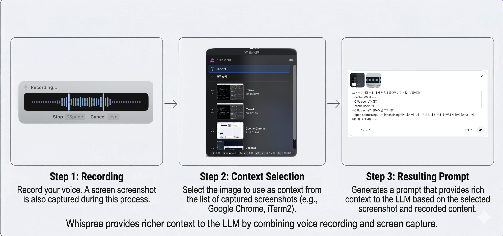

# Whispree

> Start voice-coding with just an OpenAI account. For free.

[한국어](README.ko.md) | English


<p align="center">
  
</p>

## Features

### Voice-to-Prompt

Whispree is an app that lets you **talk to AI instead of typing**. Place your cursor in any prompt input — Cursor, Claude, ChatGPT — hit a hotkey, and speak. The corrected text is automatically pasted right where your cursor was.

3–5x faster than typing, and your train of thought stays intact. Even if you switch windows while recording, Whispree remembers the original focus position and inserts text exactly there.

### Visual Context

The moment you start recording, Whispree automatically captures a screenshot of the focused screen and attaches it alongside your prompt. Visual context that's hard to convey with words alone gets included automatically, so AI understands more accurately. No more manually screenshotting, finding the file, and dragging it in.

### Code-Switching Optimization

Built for Korean developers who mix English. LLM correction handles Korean + English tech terms:

```
"밸리데이션 해야 되거든"  →  "validation 해야 되거든"
"리엑트 컴포넌트"        →  "React 컴포넌트"
"깃허브에 PR 올려놨어"   →  "GitHub에 PR 올려놨어"
```

### Correction Modes

| Mode | Description |
|------|-------------|
| Standard | Fix STT errors — spacing, spelling, misheard words |
| Filler Removal | STT correction + remove fillers (um, uh, like, you know) |
| Structured (for Prompt) | STT correction + filler removal + organize into bullet points. Even rambling speech becomes a clear instruction for AI |
| Custom | Your own custom system prompt |

### Smart Dictation

- **Record** — `Ctrl+Shift+R` (default). Push to Talk (hold to record) or Toggle (press once to start, again to stop) modes
- **Quick Fix** — `Ctrl+Shift+D` (default). Add misheard words to correction dictionary & Replace
- **Cancel** — `ESC`. Cancel anytime during recording
- All hotkeys are customizable in Settings.

### Nearly Free

STT uses Groq, LLM borrows Codex OAuth.
Groq STT is free, and OpenAI LLM correction uses [Codex CLI](https://github.com/openai/codex) auth tokens directly.
If you have an OpenAI account, you get high-quality STT + LLM correction with virtually no additional cost.

## Installation

### Homebrew (Recommended)

```bash
brew tap Arsture/whispree && brew install --cask whispree
```

### GitHub Releases

> **Note:** The app is not notarized (no Apple Developer ID). `.zip` and `.dmg` downloads from [GitHub Releases](https://github.com/Arsture/whispree/releases) will be blocked by macOS Gatekeeper. You'll need to run `xattr -cr Whispree.app` in Terminal after extracting. **Homebrew install is strongly recommended** as it handles this automatically.

### Build from Source

```bash
git clone https://github.com/Arsture/whispree.git
cd whispree
brew install xcodegen
xcodegen generate
open Whispree.xcodeproj
# Build and run with Cmd+R in Xcode
```

SPM dependencies are resolved automatically on first build.

## Usage

### Basic Flow

1. **First Launch** — Grant microphone and accessibility permissions.
2. **Download Models** — Go to Settings > Models and download the STT/LLM models you want. (Not needed for cloud providers)
3. **Record** — Place your cursor in an AI prompt input and press `Ctrl+Shift+R`. A screenshot is automatically captured.
4. **Insert** — Corrected text is automatically pasted where your cursor originally was. Even if you switched windows while recording, it returns to the exact position.

### Quick Fix

If a word keeps getting misheard, register it with `Ctrl+Shift+D`. Build domain word sets (programming, medical, etc.) to improve recognition for specific terminology.

### Settings

Access from the menu bar icon:

- **General** — Change hotkeys, recording mode (Push to Talk / Toggle), launch at login
- **STT** — Choose STT provider (WhisperKit, Groq, MLX Audio) + compatibility grades
- **LLM** — Choose LLM provider (None, 6 local models, 5 OpenAI models) + correction mode
- **Downloads** — Download/delete local models + Can I Run compatibility (RAM%, tok/s, grade)

## Tips

> **Use Structured Mode by default.** If you talk to AI often, turn on Structured mode in the LLM settings. Even rambling speech gets organized into clean bullet points. The clearer the idea in your head, the bigger the payoff — the time you'd spend formatting just disappears.

> **Pour out your plans by speaking.** When you already have a vision in your head, typing it out is the bottleneck. Hit the hotkey and talk — Structured Mode handles the formatting. Especially in early planning, speaking is far more efficient than writing things out.

> **When studying, speak the boundary of your understanding.** "I get it up to here, but this part I don't understand" — Whispree is perfect for dumping that out verbally. Articulating what you don't know in text takes forever, but speaking lets it flow naturally.

> **Make full use of screenshots.** During recording, screenshots are captured automatically as you look at different windows. Switching tabs instantly captures the previous one, and pausing on a screen for 1.5 seconds triggers a capture. Every screen you look at gets recorded. After recording, a selection panel lets you choose which screenshots to attach to your AI prompt. With Vision-capable models like OpenAI, the LLM references screenshots during correction — so even formulas and technical terms get fixed accurately. Look at an equation in a paper and say "I don't understand this part," and both the screenshot and your voice go to the AI together.

> **When you can't organize your thoughts, just type.** Speaking is faster when your thoughts are clear; typing helps you think when they're not. Whispree is closer to "a tool for quickly delivering what you already know."

> **Office Worker Tip**: Wear AirPods and pretend you're on a call. Nobody will think you're talking to objects.

## Choose Your Providers

Wants to be [OpenCode](https://github.com/nicepkg/opencode). Still a long way to go, but you can pick and choose STT and LLM providers.

| | STT | LLM |
|---|---|---|
| **Cloud (Recommended)** | [Groq](https://groq.com/) — accurate, fast | [OpenAI via Codex CLI](https://github.com/openai/codex) — use your existing account |
| **Local** | [WhisperKit](https://github.com/argmaxinc/WhisperKit) — CoreML+ANE, decent accuracy | [mlx-swift-lm](https://github.com/ml-explore/mlx-swift-lm) — 6 models supported |
| **Local** | [MLX Audio](https://github.com/ml-explore/mlx-audio) — fast, lightweight | [MLXVLM](https://github.com/ml-explore/mlx-swift-lm) — vision model (screenshot context) |

### Supported Models

The built-in **Can I Run** feature detects your hardware (chip, RAM, bandwidth) and shows compatibility grades for each model.

#### STT (Speech Recognition)

| Provider | Model | Size | Type |
|----------|-------|------|------|
| **Groq** | `whisper-large-v3-turbo` | ☁️ | Cloud |
| **WhisperKit** | `openai_whisper-large-v3_turbo` | ~1.5 GB | Local (CoreML+ANE) |
| **MLX Audio** | `Qwen3-ASR-1.7B-8bit` | ~1.0 GB | Local (Python worker) |

#### LLM (Text Correction)

| Provider | Model | Size | Notes |
|----------|-------|------|-------|
| **OpenAI** | `gpt-5.4` (default), `5.4-mini`, `5.3-codex`, `5.3-codex-spark`, `5.2-codex` | ☁️ | Best quality |
| **Local Text** | `Qwen3-1.7B-4bit` | ~940 MB | Lightweight, fast |
| **Local Text** | `Qwen3-4B-Instruct-2507-4bit` (default) | ~2.1 GB | Balanced default |
| **Local Text** | `Qwen3-8B-4bit` | ~4.3 GB | High-quality Korean |
| **Local Text** | `Qwen3-Coder-30B-A3B-Instruct-4bit` | ~16 GB | MoE coding (32GB+ recommended) |
| **Local Text** | `GLM-4.7-Flash-4bit` | ~16 GB | Chinese/Korean (32GB+ recommended) |
| **Local Vision** | `Qwen3-VL-4B-Instruct-8bit` | ~4.8 GB | Screenshot context |

## Requirements

- macOS 14.0+ (Sonoma)
- Apple Silicon (M1/M2/M3/M4)
- Microphone permission
- Accessibility permission (required for automatic text insertion)

## The Name

> It started as **FreeWhisper**. Just a tool for me, so I built it in Swift for Mac.
>
> When I decided to open-source it, FreeWhisper felt cheap. "Oh My ..." series felt dated, and **OpenWhisper** seemed taken.
>
> I thought about borrowing API keys — borrowed cat? Borrowed Whisper? **Not My Whisper**!? (Not cute anymore) came to mind.
>
> But as I kept using it, I got attached. *"Wait, this IS my whisper."*
>
> So it became **Whispree**.

## Contributing

See [CONTRIBUTING.md](CONTRIBUTING.md) for guidelines.

## License

[MIT](LICENSE)
